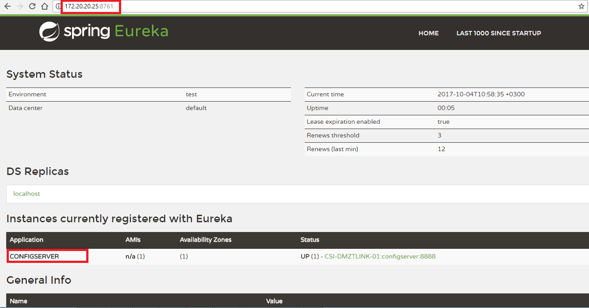
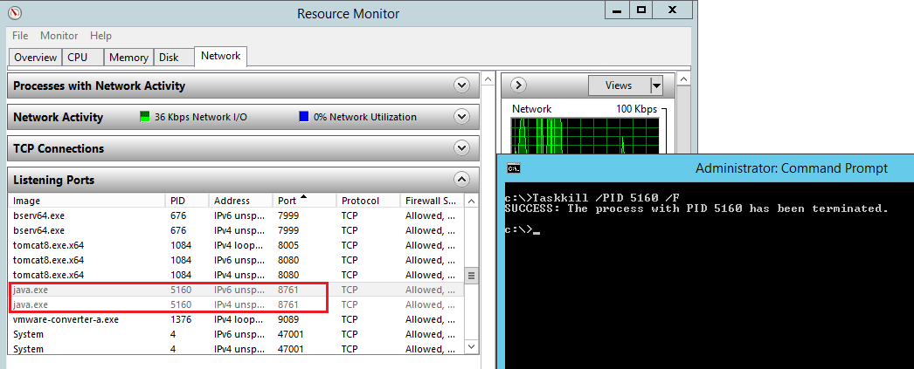

# Eureka Server Configuration 

Eureka Server is being run as a background process in server 172.20.20.25.
It status can be confirmed by executing http://172.20.20.25:8761 in the browser which gives the below result.



Eureka-Server locates under,
"C:\csi\Servers\eureka-server" in server 172.20.20.25

In case of background process failure, background process can be started by clicking on the "eureka.vbs" file in "C:\csi\Servers\eureka-server"

- or - 

run this project as a Spring Boot app by issuing below commands:
> cd C:\csi\Servers\eureka-server
> mvn spring-boot:run

#  Kill Eureka Server Running From Background 

```js
**In case of a failure, all spring-boot services (ex: config-server..etc) must be stopped prior to starting Eureka server**
```

To kill the eureka-server running in background, open up resource monitor and find out the PID own by Port 8761.
Open up command prompt as administrator and run "Taskkill /PID 5160 /F"
5160 is PID own by Port 8761.
The /f flag kills the process forcefully.


